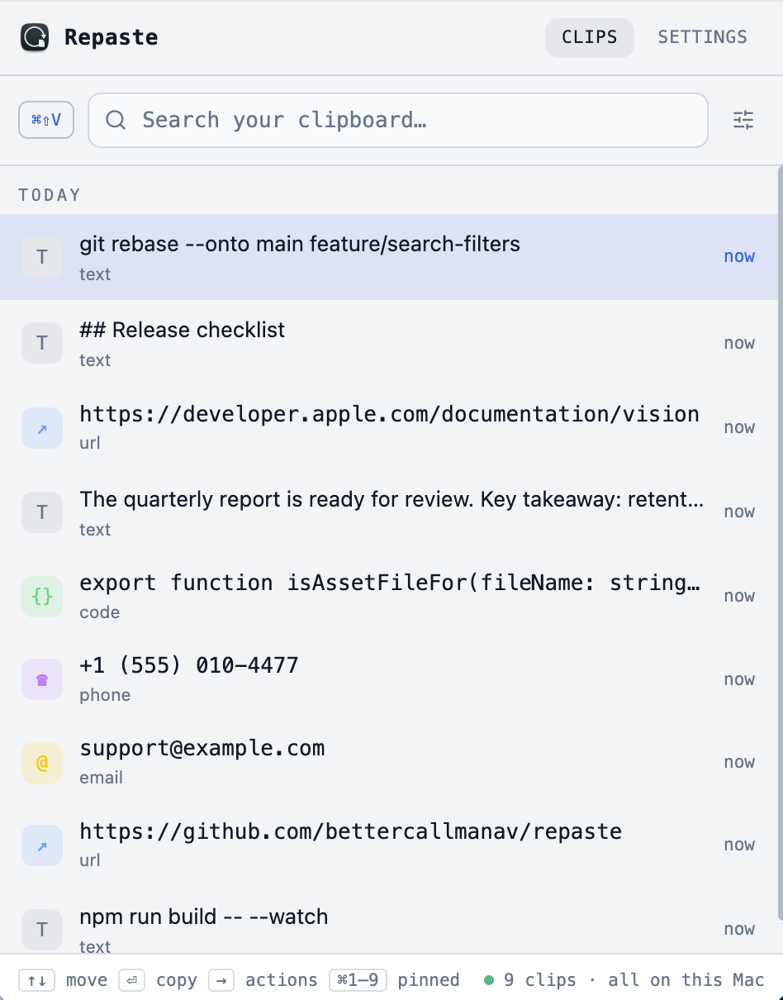

# Repaste

[](https://github.com/bettercallmanav/repaste/actions/workflows/ci.yml)

Repaste is a local-first clipboard manager for macOS. It keeps your clipboard history on your own machine, handles text and images, and adds fast full-text search, tags, tray access, and Apple Vision OCR so you can find text inside screenshots.

Everything runs on-device. There are no network calls beyond localhost.

<p align="center">
  <picture>
    <source media="(prefers-color-scheme: dark)" srcset="docs/screenshot-dark.png">
    
  </picture>
</p>

## Download

**[Download the latest release →](https://github.com/bettercallmanav/repaste/releases/latest)**

Grab either `Repaste-<version>-arm64.dmg` or `Repaste-<version>-arm64-mac.zip`, open it, and drag **Repaste** to `/Applications`.

> **Apple Silicon only.** The published builds are `arm64`. They will not run on an Intel Mac — build from source instead.

### First launch

Builds are ad-hoc signed and not notarized, so macOS will refuse to open Repaste the first time. Either:

- Open **System Settings → Privacy & Security**, scroll to the message about Repaste being blocked, and choose **Open Anyway**; or
- Clear the quarantine flag yourself:

```bash
xattr -dr com.apple.quarantine /Applications/Repaste.app
```

This is expected for an unsigned build — it is not a warning about the app's contents. Notarization needs a paid Apple Developer account.

## Features

- Local-first clipboard history, stored on-device
- Text and image capture, including image files copied in Finder
- Apple Vision OCR on image clips, with the extracted text searchable
- Full-text search with structured filters
- Pin, tag, merge, and delete clips
- Global shortcut, menu-bar tray, and keyboard-driven navigation
- Light, dark, and system appearance modes

## Keyboard

| Key | Action |
| --- | --- |
| `⌘⇧V` | Show Repaste from anywhere (global) |
| `↑` `↓` | Move through the list |
| `→` `←` | Expand / collapse the highlighted clip |
| `⏎` | Copy the highlighted clip |
| `Esc` | Clear the current search |
| `⌘1`–`⌘9` | Copy a pinned clip by slot |

`⏎` and `⌘1`–`⌘9` place the clip on your clipboard; pasting into the previous app is still a manual `⌘V`.

## Search

Repaste supports free-text search and structured filters together.

```text
design system
type:image receipt
tag:design
app:Chrome
pinned:true
from:2026-03-01 to:2026-03-10 invoice
```

Supported prefixes: `type:` `tag:` `app:` `pinned:` `from:` `to:`

Values containing spaces can be quoted, e.g. `app:"Google Chrome"`.

## OCR

Repaste uses Apple Vision to extract text from image clips.

- Runs asynchronously after capture, so a copy is never blocked on it
- Extracted text is indexed and searchable alongside everything else
- Status is tracked per clip: `pending`, `ready`, `skipped` (no text found), or `failed`
- The provider is behind an interface, leaving room for a cross-platform one later

## Platform support

- **macOS (Apple Silicon)** — the supported target
- **Windows / Linux** — packaging targets exist in the build config and the codebase is structured for them, but neither is built or tested, and OCR is macOS-only

## Development

Requires [Bun](https://bun.sh) `1.3.9+`. Building the OCR helper needs macOS with Xcode command line tools.

```bash
bun install
```

Workspace tasks:

```bash
bun run dev         # every app in parallel, via Turbo
bun run build       # contracts build first
bun run typecheck
bun run test
bun run lint
```

Individual apps:

```bash
bun run dev:web
bun run dev:server
bun run dev:desktop
```

### Packaging

```bash
cd apps/desktop
bun run pack:mac
```

Output lands in `apps/desktop/release/` as a `.dmg` and a `.zip`.

## Project structure

```text
apps/
  desktop/   Electron shell, clipboard monitor, tray, native OCR bridge
  server/    Effect-based backend, event store, projections, SQLite search
  web/       React renderer UI
packages/
  contracts/ shared schemas and IPC/websocket contracts
  shared/    shared utilities
```

Packages use the `@clipm/*` scope, an earlier name for the project.

## Architecture

Three layers in one desktop app:

1. **Electron shell** — polls the clipboard, owns the tray, global shortcut, and windows
2. **Embedded backend** — an Effect-TS server running in-process, not a subprocess
3. **React renderer** — the UI

The data flow is one-directional and event-sourced. A clipboard change becomes a command, which a pure decider turns into events; those are appended to a SQLite event log and folded into projections in a single transaction, then broadcast to clients. The UI never mutates state locally — it dispatches commands and waits for the event to come back.

Image clips are stored as files on disk and referenced by SHA-1, rather than being carried around as inline payloads.

## License

MIT — see [`LICENSE`](./LICENSE).
